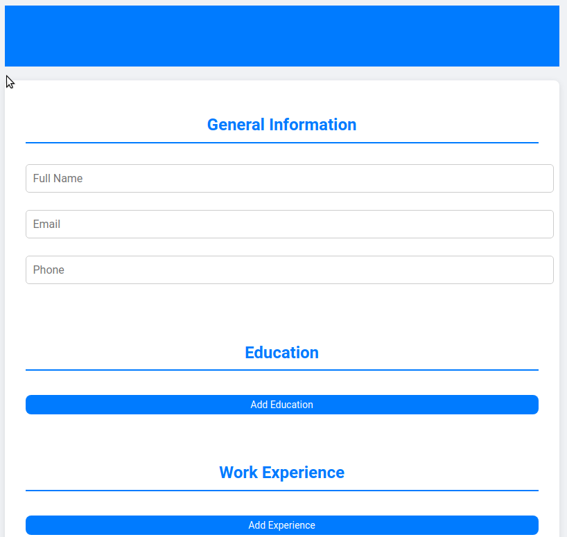

# 📄 CV Generator 🚀

Welcome to the CV Generator – your one-stop solution for creating professional resumes in a snap! ✨

## 🌟 Features

- 📝 Easy-to-use interface
- 👤 General Information section
- 🎓 Education history
- 💼 Work experience
- 🔄 Edit and preview modes
- 🖨️ Print-ready format

## 🛠️ Built With

- 
- 
- 

## 🚀 Quick Start

1. Clone the repo.
2. Install NPM packages.
3. Start dev server.

## 🌐 Live Demo

Check out the live demo [here](https://project-cv-app.vercel.app/)!

## 📸 Screenshot

## 🤝 Contributing

Contributions are what make the open-source community such an amazing place to learn, inspire, and create. Any contributions you make are **greatly appreciated**.

1. Fork the Project
2. Create your Feature Branch (`git checkout -b feature/AmazingFeature`)
3. Commit your Changes (`git commit -m 'Add some AmazingFeature'`)
4. Push to the Branch (`git push origin feature/AmazingFeature`)
5. Open a Pull Request

## 📜 License

Distributed under the MIT License. See `LICENSE` for more information.

## 📞 Contact

Vick - vickoch20@gmail.com

---
